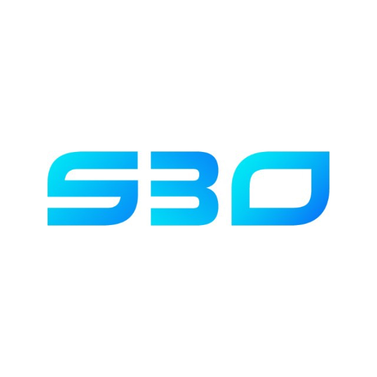

<h1 align="center">
   | Driving Digital Transformation
</h1>

  <b>We engineer cutting-edge digital solutions that empower businesses to thrive.</b>

---

## 👋 Welcome to Our Technical Hub

Soft Blue Ocean (SBO) builds the foundational technology that drives digital transformation. This GitHub profile showcases our open-source contributions, innovative tools, and the engineering excellence we bring to every client project.

Explore our code to see how we turn complex challenges into elegant, scalable solutions.

## 🛠️ Our Technical Services

Here’s a glimpse into the core technologies and domains we specialize in:

| Service Area | Our Expertise |
| :--- | :--- |
| **📱 Mobile Development** | Crafting cross-platform and native applications that manage finances, track expenses, boost sales, and deliver seamless, personalized customer experiences. |
| **🌐 Web Applications** | Developing full-stack solutions with visually appealing, responsive UIs and robust, efficient server-side logic for high-performance web platforms. |
| **🤖 AI & ML Applications** | Building custom intelligent solutions—from predictive analytics to automation—that leverage the latest advancements in Artificial Intelligence and Machine Learning. |
| **📶 IoT Integrations** | Connecting the physical and digital worlds through secure device integration, cloud platforms, data pipelines, and comprehensive security architecture. |
| **📈 Digital Marketing** | *Supporting our strategies with* technical SEO, data-driven analytics implementations, and performance marketing tool integrations. |

## 🔍 What You'll Find Here

*   **Open-Source Projects:** Tools, libraries, and frameworks we've built and shared with the community.
*   **Proof of Concepts (PoCs):** Innovative demos showcasing potential applications of emerging technologies.
*   **Development Best Practices:** Examples of our clean, documented, and well-tested code.
*   **Community Contributions:** Our team's involvement in other open-source projects.

## 💼 Beyond the Code

Our GitHub is just one part of the story. To see the full picture of how we apply this technical expertise to solve business problems:

*   **Visit our website:** [www.softblueocean.com](https://www.softblueocean.com)
*   **Connect with us on LinkedIn:** [Soft Blue Ocean on LinkedIn](https://www.linkedin.com/company/softblueocean/)
*   **Get in touch for a consultation:** [Contact Us](mailto:info@softblueocean.com)

---

  © Soft Blue Ocean. Empowering your digital journey.

